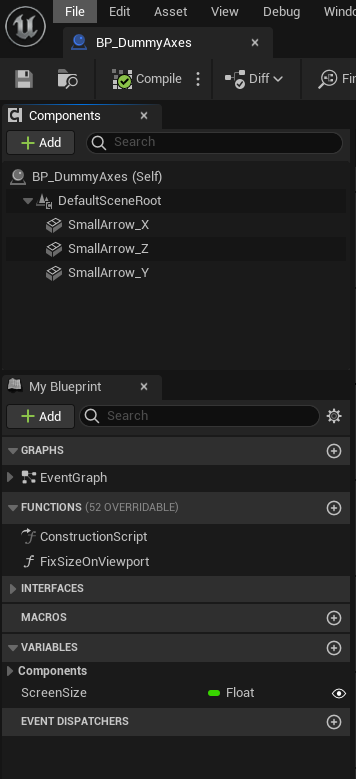
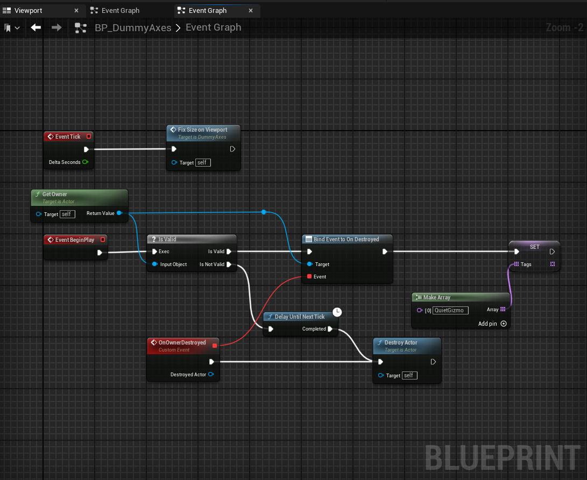
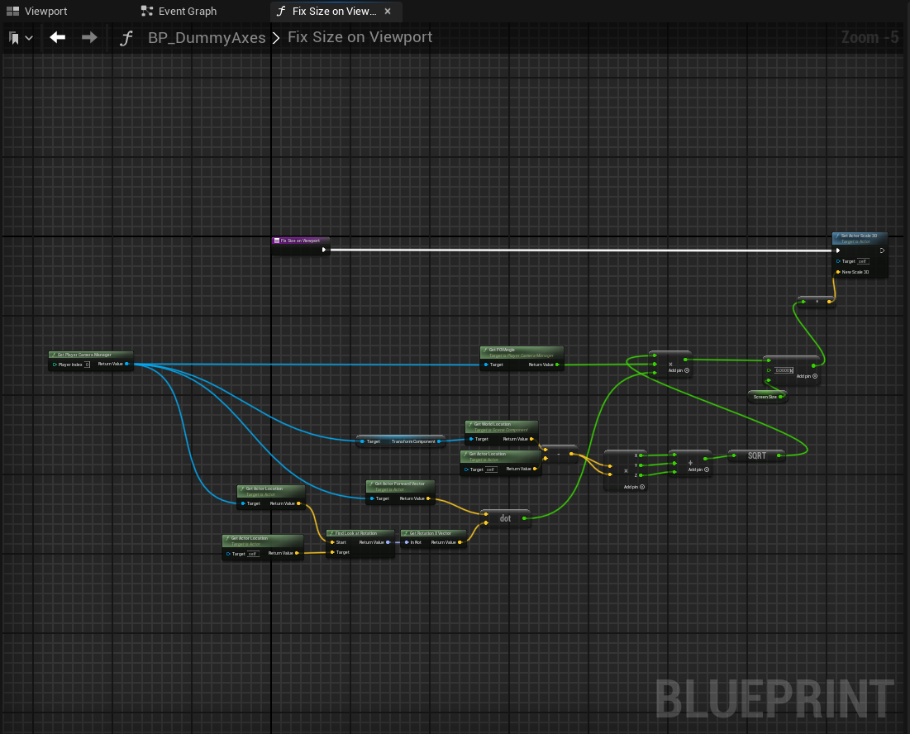

# BPShift

**Detect Blueprint behavior shift — across migrations, engine upgrades, forks, and refactors.**

BPShift captures a Blueprint's runtime behavior via UE reflection, then diffs it against
another implementation — a C++ port, the same BP on a different engine version, or the same BP
after a refactor. The diff names the exact property path that changed. No LLM in the comparator.

> **Beta (`v0.1.0`).** Targets UE 5.2 / Windows. See
> **[LIMITATIONS.md](LIMITATIONS.md)** for verified scope and constraints.

## Use it for

| Use case | Command | Why |
|---|---|---|
| 🔍 **Inspect** a Blueprint | `bpmigrate inspect MyBP` | Read structure, graphs, and refs without opening UE editor. |
| 📈 **Engine upgrade drift** | `bpmigrate parity-capture MyBP -o trace.json` → `parity-diff --a=trace_52.json --b=trace_53.json` | Find BPs that changed semantics when you bumped engine. |
| 🔁 **Refactor regression** | `bpmigrate snapshot MyBP` then `parity-diff` against baseline | Catch unintended behavior changes before they ship. |
| 🍴 **Fork sync** | snapshot both branches → `parity-diff --a=branch_a.json --b=branch_b.json` | Keep shared behavior aligned across build variants. |
| ➡️ **Migrate to C++** | `bpmigrate analyze-candidate MyBP` | Port a BP to native C++ with verified parity. |

---

### How this came to be (be candid)

This project was not designed top-down from a clean spec. It started as
hands-on reverse-engineering of UE's BP serialization + reflection +
verify path, against a single production project, with each step pulled
out into a deterministic primitive only after we hit the case in real
migration. The shape you see now -- 4 codegen primitives, snapshot/verify
parity check, caller-graph surgery, AI/no-AI split -- is the residue of
many migrations and many wrong turns. Every silent failure mode and false
PASS we tripped over is now either an explicit gate, a deterministic emit
rule, or a `LIMITATIONS.md` entry.

The expected mode of evolution is the same: you migrate a real BP, you
hit a case the toolchain doesn't cover, you add (a) the deterministic
rule that captures it, (b) the gate that surfaces it, or (c) the
`LIMITATIONS.md` row that documents the limit honestly. Issues + PRs
welcome -- the gaps are where the next round of value lives.

---

## What you can do

### A. Migrate a Blueprint to C++

End-to-end: pick a BP, generate a parity-verified C++ class.

| Stage | Command(s) | Who does it |
|---|---|---|
| 1. Decide if it's worth migrating | `analyze-candidate` | toolchain (6-criteria matrix + recommendation) |
| 2. Extract structure + logic | `dump-graph`, `inspect`, `detect-gaps` | toolchain (deterministic) |
| 3. Generate the deterministic parts | `emit-class-flags`, `emit-dispatcher-delegates`, `emit-variable-defaults`, `emit-component-overrides` | toolchain (no LLM) |
| 4. Write function bodies + decisions | the recipe (`migrate-bp.md`) | LLM (or human following the recipe) |
| 5. Capture the BP's behavior | `snapshot` (records property + scenario step trace) | toolchain |
| 6. Build the C++ | your IDE / `Build.bat` | you |
| 7. **Verify parity** | `verify` (diffs runtime trace vs C++) | toolchain (no LLM) |
| 8. Rewrite callers (if function names changed) | `analyze-candidate` → `plan-rewrite-callers` → `rewrite-callers` → `verify-callers` | toolchain (no LLM) |
| 9. PIE smoke (Tick-order, async, race conditions) | UE editor | you |

The recipe stops at user-decision gates (Step 1-E completeness gate, Step 0.5
suitability gate) so a partial result never gets quietly shipped.

### B. Inspect / analyze any Blueprint

No migration intent, no LLM, just "what is this BP made of":

| Command | What it tells you |
|---|---|
| `inspect MyBP` | full read-only summary: variables, functions, gaps, in one command |
| `dump-graph /Game/Path/MyBP` | every node, pin, connection (commandlet output, exact) |
| `detect-gaps` | orphan pins, dead inputs, missing FunctionExports, refs/body mismatch, components, parent CDO overrides, class flags, broken refs (8 categories) |
| `dump-class-reflection /Script/Module.AClass` | every UFunction + FProperty on a UClass (BP- or C++-generated) |
| `summarize <bp.json> --bytecode` | function-body pseudocode from compiled bytecode |
| `plan-rewrite-callers /Game/Path/MyBP` | every K2Node_CallFunction call-site that targets this BP, ranked |

---

## How "successful migration" is verified (without an LLM)

The parity check is the load-bearing claim. Here is exactly what happens:

```
                  BP .uasset
                      │
                      ▼
   bpmigrate snapshot  (UE editor commandlet)
                      │
                      ▼
   <BP>_behavior.json
     │  initialState   = every UPROPERTY value, serialized
     │  scenario steps = function calls + return values + post-call state
                      │
                      ▼  (you write the C++ + build)
                      │
                      ▼
   bpmigrate verify --behavior <trace> --class /Script/<Module>.<C++Class>
                      │
                      ▼
   regression_report_v3.json
     │  result                  : PASS | FAIL
     │  failedSteps             : <int>     ← scenario steps where state diverged
     │  initialValueMismatches  : <int>     ← UPROPERTY default values that disagree
     │  reflectionParityIssues  : <int>     ← UFunctions / FProperties missing on the C++ side
     │  initialStateDiffs[]     : per-property { path, expected, actual, kind }
     │  steps[]                 : per-step  { name, expected, actual, diffs[] }
                      │
                      ▼
   PASS iff failedSteps == 0  AND  initialValueMismatches == 0
```

**Every count and every diff is produced by**:
1. UE's own UPROPERTY reflection (snapshot side)
2. UE's own `CompareSnapshots` walking the JSON (verify side)
3. Python set-diff (final aggregation)

There is no LLM in any of those three steps. If the C++ class diverges
from the BP at any property path, the report tells you the **exact path**,
the **expected value**, and the **actual value** -- the LLM cannot have
silently dropped a field, because the comparator does not know which fields
the LLM wrote.

What `verify` does NOT cover (you cover it via PIE smoke in step 9):
- Tick order between subsystems
- Race conditions / async callback timing
- Engine state outside the captured scenario

The toolchain says clearly which signal is which: `verify` PASS = static-state
parity; PIE smoke = dynamic. Both are the user's call, in different ways.

---

## Where the LLM is and is not

| What | LLM? |
|---|---|
| Reading the BP, dumping graph, detecting gaps | **No** -- UE editor commandlet + Python |
| Generating `UCLASS(...)`, `UPROPERTY` initializers, constructor body, dispatcher delegate macros | **No** -- 4 deterministic codegen primitives |
| Picking between candidate fixes for broken references after reparent | **Yes** for `user_required` cases (the recipe surfaces a candidate list); **No** for `auto` cases (Layer 2 classifier picks deterministically) |
| Writing function bodies (BeginPlay, Tick, custom functions) from BP graph logic | **Yes** -- the recipe walks the LLM through 14 deterministic rules so the output stays predictable |
| Walking manual editor work (delete BP-side function graph, reparent) | **Yes** -- the recipe tells the user what to click |
| Capturing the runtime behavior trace | **No** -- editor commandlet |
| Diffing the trace vs the C++ | **No** -- editor commandlet + Python set-diff |
| Rewriting `K2Node_CallFunction` nodes in caller BPs | **No** -- C++ helper (`FBPCallFunctionRewriter`) walks the same graph the editor sees |
| Recompiling callers + reading `FCompilerResultsLog::NumErrors` | **No** -- editor commandlet |

---

## Demo: BP_DummyAxes (real Actor BP)

`BP_DummyAxes` is a 3-axis gizmo: 4 components (root + X/Y/Z arrows),
1 variable (`ScreenSize`), 1 function (`FixSizeOnViewport`), 1
`BeginPlay` event, 1 `Tick`, and one implemented BP-defined interface
(important — the recipe will flag it; see stage 2).

### 1. The BP (input)

| | |
|---|---|
| Component tree + Variables / Functions |  |
| `EventGraph` (BeginPlay branch) |  |
| `FixSizeOnViewport` function (the Tick body) |  |

### 2. Suitability check (toolchain decides path before any C++ is written)

```
$ bpmigrate analyze-candidate /Game/Path/To/BP_DummyAxes

# analyze-candidate: /Game/Path/To/BP_DummyAxes
_ParentClass:_ `Actor`

| Criterion | Status | Note |
|---|---|---|
| SCS components | ✅ | 1 (no overlap risk) |
| BP-defined Interfaces | ❌ | BI_<MyInterface>_C — UFUNCTION on a C++ port collides with BP-defined Interface override; selective migration only (interface method bodies stay BP-side). |
| Variables | ✅ | 1 variables |
| Functions | - | 13 graphs (logic-heavy ≥10 nodes: 2, stubs ≤2 nodes: 11) |
| Caller count (BP-only) | ✅ | 0 caller BP(s) |
| Reload-time validation | ⚠ | always run `bpmigrate verify-callers` after surgery |

**Recommendation**: PROCEED WITH SELECTIVE MIGRATION
— leave the BP-defined interface method bodies BP-side; native-port only the
non-interface functions.
```

The toolchain calls out the structural blocker (BP-defined interface) and
recommends *selective* migration *before* the LLM writes a line of C++.

### 3. Deterministic codegen (no LLM)

```
$ bpmigrate emit-component-overrides <graph>.json
```

The BP's SCS template carries **53 component default overrides** across the
4 components -- mesh, two materials, collision profile, per-channel collision
responses, mass override, damping, mass scale, max angular velocity, gravity,
auto-weld, transform, etc. The codegen primitive emits each of them as a
real UE setter call (`SetStaticMesh`, `SetMaterial`, `SetCollisionResponseToChannel`,
`SetMassOverride`, `SetRelativeRotation_Direct`, ...) routed through the
correct public API -- protected `BodyInstance` fields go through
`GetBodyInstance()->SetXxx(...)`, nested `CollisionResponses` get expanded
to per-channel calls, etc.

Shape (one arrow component, abridged):

```cpp
SmallArrow_Y = CreateDefaultSubobject<UStaticMeshComponent>(TEXT("SmallArrow_Y"));
SmallArrow_Y->SetupAttachment(DefaultSceneRoot);
SmallArrow_Y->SetStaticMesh(LoadObject<UStaticMesh>(nullptr, TEXT("/Game/Path/SM_Arrow.SM_Arrow")));
SmallArrow_Y->SetMaterial(0, LoadObject<UMaterialInterface>(nullptr, TEXT("/Game/Path/MI_Axis_Y.MI_Axis_Y")));
SmallArrow_Y->SetCollisionResponseToChannel(ECollisionChannel::ECC_Visibility, ECR_Ignore);
SmallArrow_Y->GetBodyInstance()->SetMassOverride(100.000000f, false);
SmallArrow_Y->SetRelativeRotation_Direct(FRotator(0.0f, 90.0f, 0.0f));
// ... (24 more lines on this component, replicated for SmallArrow_X / SmallArrow_Z)
```

The LLM never wrote any of these. Whatever the BP's editor template carries,
the verify step (next) confirms it survived the migration byte-for-byte.

### 4. Function-body C++ (LLM)

The LLM follows the 14 deterministic rules in `skill/migrate-bp.md` to convert
the BP `EventGraph` and `FixSizeOnViewport` function into native C++ -- this
is the part that genuinely needs judgment (which UE API maps to which K2Node,
how to handle the `IsValid` branch, etc.).

### 5. The verify result

After building the C++ class (`ABPDummyAxesMin`), with the partial
migration in place:

```
$ bpmigrate verify \
    --behavior <BP>_behavior.json \
    --class /Script/<YourModule>.ABPDummyAxesMin \
    -o <BP>_report.json

  result                : FAIL
  totalSteps            : 102
  passedSteps           : 2
  failedSteps           : 100
  initialValueMismatches: 0       ✅  every UPROPERTY default value matches
  reflectionParityIssues: 34      ←   the 32 BP-defined interface methods (selective)
                                       + 2 related dispatcher hooks
```

Reading the report:
- **`initialValueMismatches: 0`** -- every component override the BP's SCS
  template carries (53 fields verified above) is replicated faithfully on
  the C++ side. The toolchain told the LLM exactly what to emit; the verifier
  confirms it byte-for-byte.
- **`reflectionParityIssues: 34`** -- exactly the BI_*_C interface methods
  the `analyze-candidate` step flagged in stage 1. This is the cost of the
  user-chosen *selective* migration, surfaced as a precise number, not a
  vague warning.
- **`failedSteps: 100`** -- the auto-generated scenario calls every
  BP-defined interface method on the BP and expects matching outputs
  on the C++ class. With 32 methods unimplemented (the selective decision),
  most steps fail predictably. Each failed step lists the exact method and
  the expected vs actual outputs.

If you migrate a BP that has no BP-defined interface, both numbers go to
zero and `result: PASS`. The signals are independent: an LLM cannot fool
the verifier into reporting `initialValueMismatches: 0` -- the comparator
walks UPROPERTY reflection from outside.

---

## Quick start

> **Windows shell note.** Examples below use bash syntax. On **Git Bash /
> MSYS / WSL**, also `export MSYS_NO_PATHCONV=1` in your shell rc -- otherwise
> `/Game/...` arguments get rewritten to `C:/Program Files/Git/Game/...`
> before they reach the editor. On **cmd / PowerShell**, translate `cp`
> to `xcopy` and `export VAR=val` to `set VAR=val`. Always write env-var
> paths in **forward-slash Windows** form (`'C:/Program Files/...'`).

```
# 1. Install the CLI
pip install -e .
# (Or invoke directly: `python python/bpmigrate.py ...`)

# 2. Install the UE plugin
cp -r ue-plugin/BPMigration <YourProject>/Plugins/
# Then enable it in <YourProject>/<Game>.uproject:
#   "Plugins": [
#     { "Name": "BPMigration", "Enabled": true }, ...
#   ]
# Recompile your project from your IDE.

# 3. (For Claude Code users) install the slash commands
cp skill/*.md ~/.claude/commands/

# 4. Configure
export BPMIGRATION_PROJECT_ROOT='C:/Path/To/YourProject'    # parent of Content/
export BPMIGRATION_UPROJECT='C:/Path/To/YourProject/Game.uproject'
export BPMIGRATION_UE_CMD='C:/Program Files/Epic Games/UE_5.2/Engine/Binaries/Win64/UnrealEditor-Cmd.exe'

# 5. Read-only inspection (PROJECT_ROOT only)
bpmigrate inspect MyBlueprint

# 6. Editor-driven analysis (needs all three env vars)
bpmigrate dump-graph             /Game/Path/To/MyBlueprint
bpmigrate dump-class-reflection  /Script/Module.MyClass
bpmigrate analyze-candidate      /Game/Path/To/MyBP

# 7. Deterministic codegen (no LLM)
bpmigrate emit-class-flags          <graph>.json
bpmigrate emit-dispatcher-delegates <bp>.json
bpmigrate emit-variable-defaults    <bp>.json
bpmigrate emit-component-overrides  <graph>.json

# 8. Caller-graph surgery + post-cycle validation
bpmigrate plan-rewrite-callers /Game/Path/To/MyBP
bpmigrate rewrite-callers \
    --callers=/Game/Path/CallerA,/Game/Path/CallerB \
    --old="/Game/.../OldBP.OldBP_C.OldFnName" \
    --new="/Game/.../OldBP.OldBP_C.NewFnName" \
    --save
bpmigrate verify-callers --target=/Game/Path/To/MyBP

# 9. Behavior parity check (snapshot/verify)
bpmigrate snapshot ...
bpmigrate verify ...

bpmigrate --help                    # every subcommand

# Or from Claude Code:
/inspect-bp MyBlueprint
/migrate-bp MyBlueprint
```

`PROJECT_ROOT` alone covers the read-only commands (`inspect`,
`uasset-tojson`, `summarize`, `detect-gaps`, `map-broken-refs`,
`apply-fix-mapping`, the `emit-*` family); editor-driven commandlets
(`dump-graph`, `dump-class-reflection`, `snapshot`, `verify`,
`analyze-candidate`, `plan-rewrite-callers`, `rewrite-callers`,
`verify-callers`) need the other two.

---

## Built on

Blueprint asset reading is powered by
**[UAssetGUI](https://github.com/atenfyr/UAssetGUI)** by
[atenfyr](https://github.com/atenfyr) (MIT). The binary is bundled in
`tools/UAssetGUI/UAssetGUI.exe`; `bpmigrate` invokes it for `tojson`
conversion. Editor commandlets and helpers under `ue-plugin/BPMigration/`
are this project's own MIT C++ code.

---

## Repository layout

```
skill/                       Slash-command recipes (markdown). Drive any LLM, not just Claude Code.
python/                      CLI + analysis core (bpmigrate.py + helpers).
ue-plugin/                   BPMigration UE plugin source (editor commandlets + helpers).
tools/                       Bundled UAssetGUI.exe (MIT) + its LICENSE.
tests/                       Determinism contract + caller-plan accuracy regression tests.
examples/                    Worked examples — what each stage produces on a real BP.
docs/                        Supplementary docs (see below).
.github/ISSUE_TEMPLATE/      Bug + feature templates.
pyproject.toml               Package metadata; install via `pip install -e .`.
LIMITATIONS.md / CONTRIBUTING.md / NOTICE.md / LICENSE
```

---

## More docs

- **[LIMITATIONS.md](LIMITATIONS.md)** — verified scope, untested rows,
  known constraints. **Read before relying on this for production
  migrations.** The full `analyze → plan → emit → reparent → cleanup →
  rewrite-callers → verify-callers → user PIE` cycle is validated
  end-to-end against real production Blueprints. Known structural limits:
  SCS-overlap BPs require Step 5-A-3 clean-slate replacement; BPs
  implementing a BP-defined `BI_*_C` interface require selective migration.
- **[docs/INSTALL.md](docs/INSTALL.md)** — fresh-project install +
  troubleshooting matrix.
- **[docs/UE_VERSIONS.md](docs/UE_VERSIONS.md)** — what to bump when
  targeting UE 5.3 / 5.4 / later.
- **[docs/CROSS_PLATFORM.md](docs/CROSS_PLATFORM.md)** — macOS / Linux
  shim options for the bundled Windows-only UAssetGUI.exe.
- **[docs/LLM_AGNOSTIC.md](docs/LLM_AGNOSTIC.md)** — running the recipe
  with GPT, Gemini, Llama, etc.
- **[docs/SURGERY_BACKEND.md](docs/SURGERY_BACKEND.md)** — caller-side
  surgery internals (shipped) + self-side broken-ref backend input
  contract (deferred).
- **[CONTRIBUTING.md](CONTRIBUTING.md)** — what to submit and how.
- **[examples/dummy-axes-fixture/README.md](examples/dummy-axes-fixture/README.md)**
  — worked example matching the demo above.

---

## License

MIT — see [LICENSE](LICENSE).

Bundled [UAssetGUI](https://github.com/atenfyr/UAssetGUI) by atenfyr is
MIT-licensed; see [NOTICE.md](NOTICE.md) and `tools/UAssetGUI/LICENSE`.
